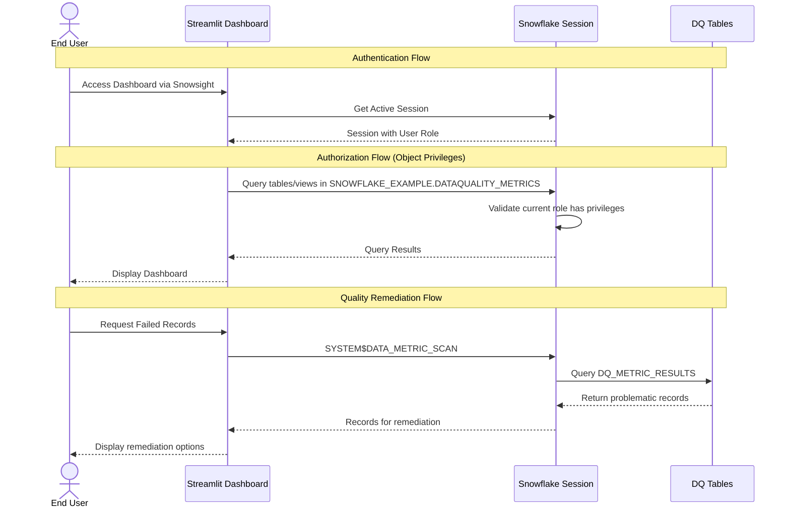

# Auth Flow - Data Quality Metrics Demo

Author: SE Community
Last Updated: 2026-01-06
Expires: 2026-02-05 (30 days from creation)
Status: Reference Implementation

**Reference Implementation:** This code demonstrates production-grade architectural patterns and best practices. Review and customize security, networking, and logic for your organization's specific requirements before deployment. Not for production use.

## Overview

This diagram shows the authentication and authorization flows for the Streamlit app, including Snowflake session context, object privilege checks, and the quality remediation workflow using system DMFs.

## Diagram

## Component Descriptions

### End User
- **Purpose:** Data analyst or business user accessing quality dashboards
- **Technology:** Web browser via Snowsight
- **Location:** External
- **Dependencies:** Snowflake account credentials

### Streamlit Dashboard (DATA_QUALITY_DASHBOARD)
- **Purpose:** Interactive UI for quality monitoring and remediation
- **Technology:** Streamlit in Snowflake
- **Location:** `SNOWFLAKE_EXAMPLE.DATAQUALITY_METRICS`
- **Dependencies:** Snowflake session

### Snowflake Session
- **Purpose:** Authenticated session context with role assignment
- **Technology:** Snowflake session management
- **Location:** Snowflake platform
- **Dependencies:** User credentials, role grants

### DQ Tables
- **Purpose:** Storage for quality metrics and remediation logs
- **Technology:** Snowflake standard tables
- **Location:** `SNOWFLAKE_EXAMPLE.DATAQUALITY_METRICS`
- **Dependencies:** DMF associations

## Role Hierarchy

| Role | Access Level | Description |
|------|--------------|-------------|
| ACCOUNTADMIN | Full | Deploy and manage demo |
| DATA_ANALYST | Standard | Full data access, remediation |
| LIMITED_ACCESS | Restricted | Non-sensitive data only |
| PUBLIC | None | No access to demo objects |

## Security Controls

| Control | Type | Purpose |
|---------|------|---------|
| Role Grants | Authorization | Control object access |

## Change History

See repository history for version changes.
