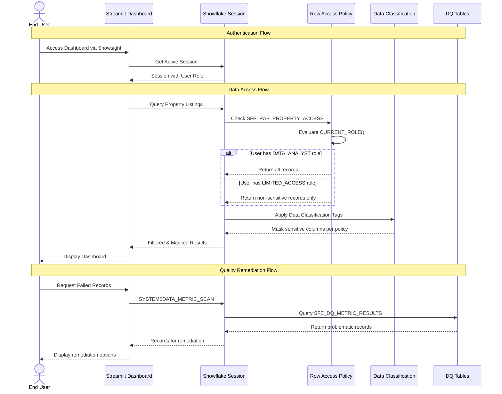

# Auth Flow - Data Quality Metrics Demo

Author: SE Community  
Last Updated: 2025-12-01  
Expires: 2025-12-31 (30 days from creation)  
Status: Reference Implementation

**Reference Implementation:** This code demonstrates production-grade architectural patterns and best practices. Review and customize security, networking, and logic for your organization's specific requirements before deployment.

## Overview

This diagram shows the authentication and authorization flows including Streamlit session management, row access policy evaluation, data classification, and quality remediation workflows.

## Diagram

## Component Descriptions

### End User
- **Purpose:** Data analyst or business user accessing quality dashboards
- **Technology:** Web browser via Snowsight
- **Location:** External
- **Dependencies:** Snowflake account credentials

### Streamlit Dashboard (SFE_DATA_QUALITY_DASHBOARD)
- **Purpose:** Interactive UI for quality monitoring and remediation
- **Technology:** Streamlit in Snowflake
- **Location:** `SNOWFLAKE_EXAMPLE.SFE_ANALYTICS_REALESTATE`
- **Dependencies:** Snowflake session

### Snowflake Session
- **Purpose:** Authenticated session context with role assignment
- **Technology:** Snowflake session management
- **Location:** Snowflake platform
- **Dependencies:** User credentials, role grants

### Row Access Policy (SFE_RAP_PROPERTY_ACCESS)
- **Purpose:** Role-based row filtering for property data
- **Technology:** Snowflake Row Access Policy
- **Location:** `SNOWFLAKE_EXAMPLE.SFE_ANALYTICS_REALESTATE`
- **Dependencies:** Role definitions

### Data Classification
- **Purpose:** Automatic sensitive data tagging and masking
- **Technology:** Snowflake Data Classification
- **Location:** Applied to table columns
- **Dependencies:** Classification policies

### DQ Tables
- **Purpose:** Storage for quality metrics and remediation logs
- **Technology:** Snowflake standard tables
- **Location:** `SNOWFLAKE_EXAMPLE.SFE_ANALYTICS_REALESTATE`
- **Dependencies:** DMF associations

## Role Hierarchy

| Role | Access Level | Description |
|------|--------------|-------------|
| ACCOUNTADMIN | Full | Deploy and manage demo |
| DATA_ANALYST | Standard | Full data access, remediation |
| LIMITED_ACCESS | Restricted | Non-sensitive data only |
| PUBLIC | None | No access to demo objects |

## Security Controls

| Control | Type | Purpose |
|---------|------|---------|
| Row Access Policy | Authorization | Filter rows by role |
| Data Classification | Privacy | Tag sensitive columns |
| Masking Policy | Privacy | Mask sensitive values |
| Role Grants | Authorization | Control object access |

## Change History

See `.cursor/DIAGRAM_CHANGELOG.md` for version history.

