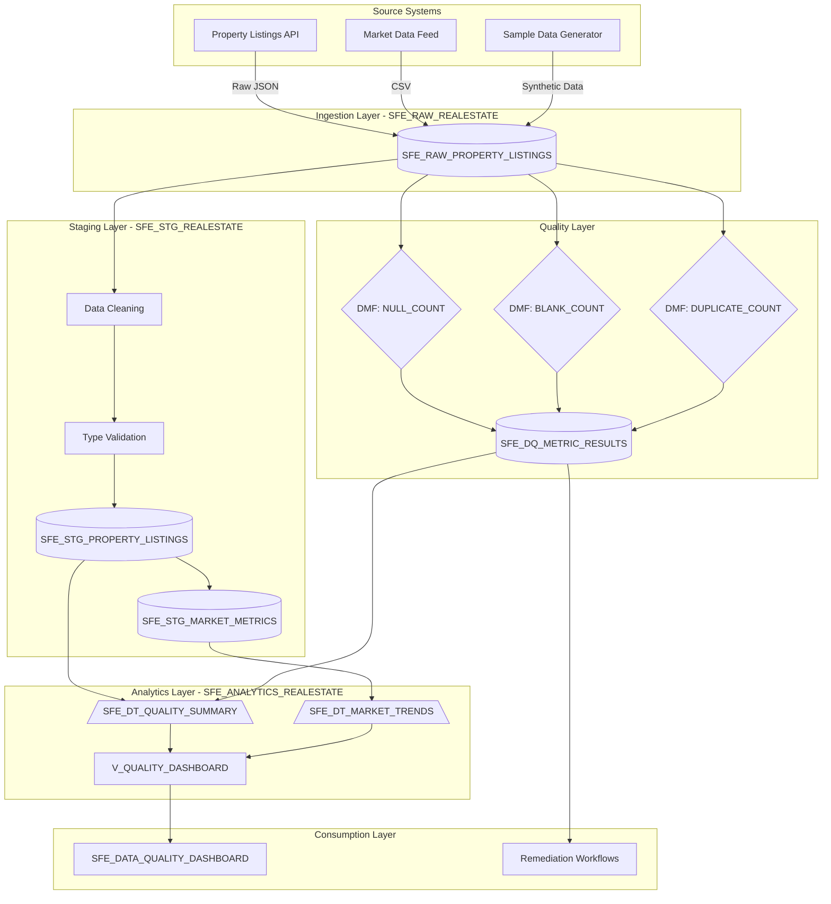

# Data Flow - Data Quality Metrics Demo

Author: SE Community  
Last Updated: 2025-12-01  
Expires: 2025-12-31 (30 days from creation)  
Status: Reference Implementation

**Reference Implementation:** This code demonstrates production-grade architectural patterns and best practices. Review and customize security, networking, and logic for your organization's specific requirements before deployment.

## Overview

This diagram shows how data flows through the system from source ingestion through quality monitoring, transformation, and analytics to final consumption via the Streamlit dashboard.

## Diagram

## Component Descriptions

### Source Systems
- **Purpose:** External data sources that provide property listings and market data
- **Technology:** APIs, CSV feeds, synthetic data generators
- **Location:** External to Snowflake
- **Dependencies:** None

### Ingestion Layer (SFE_RAW_REALESTATE)
- **Purpose:** Raw data landing zone preserving original data format
- **Technology:** Snowflake standard tables
- **Location:** `SNOWFLAKE_EXAMPLE.SFE_RAW_REALESTATE`
- **Dependencies:** Source systems

### Quality Layer
- **Purpose:** Automated data quality monitoring using system DMFs
- **Technology:** Snowflake Data Metric Functions
- **Location:** Associated with SFE_RAW_PROPERTY_LISTINGS
- **Dependencies:** Raw tables

### Staging Layer (SFE_STG_REALESTATE)
- **Purpose:** Data cleaning, validation, and transformation
- **Technology:** Snowflake standard tables
- **Location:** `SNOWFLAKE_EXAMPLE.SFE_STG_REALESTATE`
- **Dependencies:** Raw tables

### Analytics Layer (SFE_ANALYTICS_REALESTATE)
- **Purpose:** Real-time analytics via Dynamic Tables and Views
- **Technology:** Dynamic Tables with TARGET_LAG
- **Location:** `SNOWFLAKE_EXAMPLE.SFE_ANALYTICS_REALESTATE`
- **Dependencies:** Staging tables, DQ results

### Consumption Layer
- **Purpose:** User-facing Streamlit dashboard and remediation workflows
- **Technology:** Streamlit in Snowflake
- **Location:** `SNOWFLAKE_EXAMPLE.SFE_ANALYTICS_REALESTATE`
- **Dependencies:** Analytics views

## Data Transformations

| Stage | Input | Transformation | Output |
|-------|-------|----------------|--------|
| Ingest | Source APIs | Raw capture | SFE_RAW_PROPERTY_LISTINGS |
| Monitor | Raw tables | DMF evaluation | SFE_DQ_METRIC_RESULTS |
| Clean | Raw data | Null handling, type casting | SFE_STG_PROPERTY_LISTINGS |
| Aggregate | Staged data | Monthly grouping | SFE_STG_MARKET_METRICS |
| Analyze | All layers | Dynamic aggregation | SFE_DT_QUALITY_SUMMARY |
| Present | Analytics | View composition | V_QUALITY_DASHBOARD |

## Change History

See `.cursor/DIAGRAM_CHANGELOG.md` for version history.

