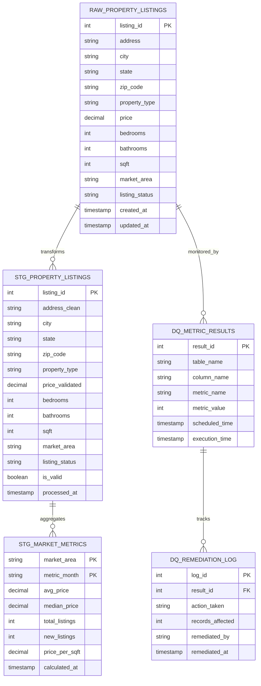

# Data Model - Data Quality Metrics Demo

Author: SE Community
Last Updated: 2026-01-06
Expires: 2026-02-05 (30 days from creation)
Status: Reference Implementation

**Reference Implementation:** This code demonstrates production-grade architectural patterns and best practices. Review and customize security, networking, and logic for your organization's specific requirements before deployment. Not for production use.

## Overview

This diagram shows the database schema and table relationships for the Data Quality Metrics demo. The model includes raw property data landing tables, staged/cleaned data, quality metric results storage, and remediation tracking.

## Diagram

## Component Descriptions

### RAW_PROPERTY_LISTINGS
- **Purpose:** Raw data landing table for property listings with intentional quality issues for demo purposes
- **Technology:** Snowflake standard table
- **Location:** `SNOWFLAKE_EXAMPLE.DATAQUALITY_METRICS`
- **Dependencies:** Sample data generator

### STG_PROPERTY_LISTINGS
- **Purpose:** Cleaned and validated property data after transformation
- **Technology:** Snowflake standard table
- **Location:** `SNOWFLAKE_EXAMPLE.DATAQUALITY_METRICS`
- **Dependencies:** RAW_PROPERTY_LISTINGS

### STG_MARKET_METRICS
- **Purpose:** Monthly aggregated market statistics by area
- **Technology:** Snowflake standard table
- **Location:** `SNOWFLAKE_EXAMPLE.DATAQUALITY_METRICS`
- **Dependencies:** STG_PROPERTY_LISTINGS

### DQ_METRIC_RESULTS
- **Purpose:** Storage for DMF execution results and quality scores
- **Technology:** Snowflake standard table
- **Location:** `SNOWFLAKE_EXAMPLE.DATAQUALITY_METRICS`
- **Dependencies:** DMF associations on RAW_PROPERTY_LISTINGS

### DQ_REMEDIATION_LOG
- **Purpose:** Audit trail for remediation actions taken on quality issues
- **Technology:** Snowflake standard table
- **Location:** `SNOWFLAKE_EXAMPLE.DATAQUALITY_METRICS`
- **Dependencies:** DQ_METRIC_RESULTS

## Change History

See repository history for version changes.
