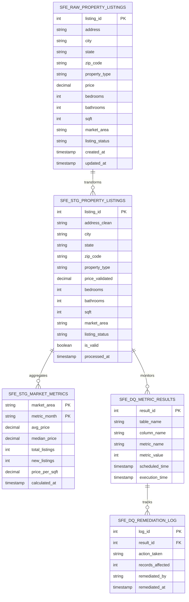

# Data Model - Data Quality Metrics Demo

Author: SE Community  
Last Updated: 2025-12-01  
Expires: 2025-12-31 (30 days from creation)  
Status: Reference Implementation

**Reference Implementation:** This code demonstrates production-grade architectural patterns and best practices. Review and customize security, networking, and logic for your organization's specific requirements before deployment.

## Overview

This diagram shows the database schema and table relationships for the Data Quality Metrics demo. The model includes raw property data landing tables, staged/cleaned data, quality metric results storage, and remediation tracking.

## Diagram

## Component Descriptions

### SFE_RAW_PROPERTY_LISTINGS
- **Purpose:** Raw data landing table for property listings with intentional quality issues for demo purposes
- **Technology:** Snowflake standard table
- **Location:** `SNOWFLAKE_EXAMPLE.SFE_RAW_REALESTATE`
- **Dependencies:** Sample data generator

### SFE_STG_PROPERTY_LISTINGS
- **Purpose:** Cleaned and validated property data after transformation
- **Technology:** Snowflake standard table
- **Location:** `SNOWFLAKE_EXAMPLE.SFE_STG_REALESTATE`
- **Dependencies:** SFE_RAW_PROPERTY_LISTINGS

### SFE_STG_MARKET_METRICS
- **Purpose:** Monthly aggregated market statistics by area
- **Technology:** Snowflake standard table
- **Location:** `SNOWFLAKE_EXAMPLE.SFE_STG_REALESTATE`
- **Dependencies:** SFE_STG_PROPERTY_LISTINGS

### SFE_DQ_METRIC_RESULTS
- **Purpose:** Storage for DMF execution results and quality scores
- **Technology:** Snowflake standard table
- **Location:** `SNOWFLAKE_EXAMPLE.SFE_ANALYTICS_REALESTATE`
- **Dependencies:** DMF associations on SFE_RAW_PROPERTY_LISTINGS

### SFE_DQ_REMEDIATION_LOG
- **Purpose:** Audit trail for remediation actions taken on quality issues
- **Technology:** Snowflake standard table
- **Location:** `SNOWFLAKE_EXAMPLE.SFE_ANALYTICS_REALESTATE`
- **Dependencies:** SFE_DQ_METRIC_RESULTS

## Change History

See `.cursor/DIAGRAM_CHANGELOG.md` for version history.

