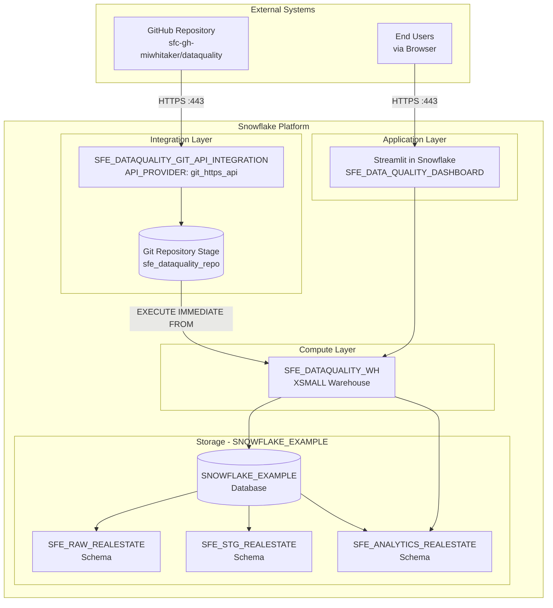

# Network Flow - Data Quality Metrics Demo

Author: SE Community  
Last Updated: 2025-12-01  
Expires: 2025-12-31 (30 days from creation)  
Status: Reference Implementation

**Reference Implementation:** This code demonstrates production-grade architectural patterns and best practices. Review and customize security, networking, and logic for your organization's specific requirements before deployment.

## Overview

This diagram shows the network architecture and connectivity between external systems (GitHub, users) and Snowflake components including Git integration, compute layer, storage, and applications.

## Diagram

## Component Descriptions

### GitHub Repository
- **Purpose:** Source code repository for SQL scripts, Streamlit app, and documentation
- **Technology:** GitHub public repository
- **Location:** https://github.com/sfc-gh-miwhitaker/dataquality
- **Dependencies:** None

### End Users
- **Purpose:** Data analysts and business users accessing the dashboard
- **Technology:** Web browser
- **Location:** External network
- **Dependencies:** Snowflake account access

### SFE_DATAQUALITY_GIT_API_INTEGRATION
- **Purpose:** Secure connection between Snowflake and GitHub
- **Technology:** Snowflake API Integration (git_https_api)
- **Location:** Account-level object
- **Dependencies:** GitHub repository access

### Git Repository Stage (sfe_dataquality_repo)
- **Purpose:** Snowflake representation of the GitHub repository
- **Technology:** Snowflake Git Repository
- **Location:** `SNOWFLAKE_EXAMPLE.DATAQUALITY_GIT_REPOS`
- **Dependencies:** API Integration

### SFE_DATAQUALITY_WH
- **Purpose:** Dedicated compute for demo workloads
- **Technology:** Snowflake Virtual Warehouse (XSMALL)
- **Location:** Account-level object
- **Dependencies:** None

### SNOWFLAKE_EXAMPLE Database
- **Purpose:** Container for all demo schemas and objects
- **Technology:** Snowflake Database
- **Location:** Account-level object
- **Dependencies:** None

### Streamlit Dashboard
- **Purpose:** Interactive data quality monitoring UI
- **Technology:** Streamlit in Snowflake
- **Location:** `SNOWFLAKE_EXAMPLE.SFE_ANALYTICS_REALESTATE`
- **Dependencies:** Warehouse, Analytics views

## Network Protocols

| Connection | Protocol | Port | Authentication |
|------------|----------|------|----------------|
| GitHub to Snowflake | HTTPS | 443 | API Integration |
| User to Snowsight | HTTPS | 443 | Snowflake Auth |
| User to Streamlit | HTTPS | 443 | Snowflake Auth |

## Change History

See `.cursor/DIAGRAM_CHANGELOG.md` for version history.

